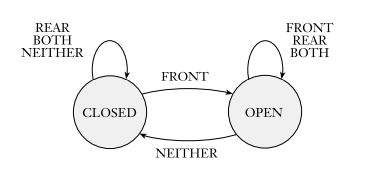
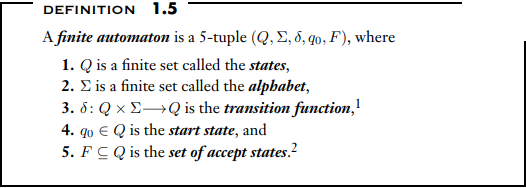
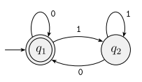
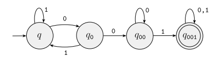
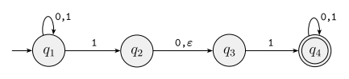
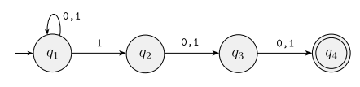

# Regular Languages
What is a computer?
We use a computational model to study the theory. We begin with the simplest model, the finite state machine or finite automaton.

## Finite Automata
A good example of finite automata is a controller for an automatic door. The controller is in either of two states, "open" or "closed", representing the corresponding condition of the door. 


In a finite automata, there are state diagrams. Within state diagrams there exists
- a start state - indicated by an arrow pointing into it from nowhere
- an accept state - indicated by a double circle
- transitions - indicated by arrows going from one state to another

Finite automata have only two output, accept or reject

### Formal Definition of A finite Automaton
A formal definition is precise, resolving any uncertainties about what is allowed in a finite automaton. Additionally, formal definitons provide notation.

```
it is fine for finite automata to have 0 accept states, and there must exist exactly one transition exiting every state for each possible input symbol
```


Consider this finite automaton



This machine M3 has a start state that is also an accept state. Therefore, if the string reads the empty string it will accept. The language for this machine is as follows
> L(M3)={w|w is the empty string ε or ends in a 0}

Another example is as follows

L={w|w contains the string 001}
### Formal Definition of Computation
```
A language is called a regular language if some finite automaton recognizes it
```
### The Regular Operations
Let A and B be languages. We define the regular operations *union*, *concatenation*, and *star* as follows:
```
Union: A ∪ B = {x|x∈A or x∈B}
Concatenation A ◦ B = {xy|x∈A and y∈B}
Star: A* = {x1x2...xk| k>=0 and each x∈A}
```
The class of regular languages is closed under the union operation

In other words, if A1 and A2 are regular languages, so is A1 ∪ A2

Proof: We know that because A1 and A2 are regular, there is some finite automaton M1 that recognizes A1, and some finite automaton M2 that recognizes A2, to prove A1 ∪ A2 is regular, we must demonstrate a finite automaton, called M, that recognizes A1 ∪ A2
This is a proof by construction. 

## Nondeterminism
Every step of a computation follows in a unique way from the preceding step, when the machine is in a given state and reads the next input smbol, we know what the next state will be - it is determined. This is called deterministic computation. In a nondeterministic machine, several choices may exist for the next state at any point

For every deterministic finite automaton, there is automatically a nondeterministic finite automaton. 


The image above shows a nondeterministic finite automaton N1. 

The differences between a DFA and NFA are apparent. First, every state of a DFA always has exactly one exiting transition arrow for each symbol of the alphabet. In an NFA, a state may have zero, one, or many exiting arrows for each alphabet symbol. Secondly, in a DFA, labels on the transition arrows are symbols from the alphabet. In general, an NFA may have arrows labeled with members of the alphabet or ε. Zero, one, or many arrows may exit from each state with the label ε

An exmple of an NFA N2 recognizing the language A, consisting of all strings over {0, 1} containing 1 in the third position from the end


### Formal Definition of a Nondeterministic Finite Automaton
Both NFA and DFA have states, an input alphabet, a transition function, a start state, and a collection of accept states. However they differ in one essential way: in the type of transition function. In a DFA, the transition function takes a state and an input symbol and produces the next state. In an NFA, the transition function takes a state and an input symbol *or the empty string* and produces *the set of possible next states*

### Equivalence of NFAs and DFAs
They both recognize the same class of languages. Every nondeterministic finite automaton has an equivalent deterministic finite automaton. 

As such, you can use it as a proof concept. If a language is recognized by an NFA, then there must exist some DFA that will also recognize it. This is compounded by the fact that a languages regularity can be proved. As a language is regular if and only if some nondeterministic finite automata recognizes it
